# news_classification

类别与tag对照表

| 新闻类别 | tag  |
| -------- | ---- |
| 财经     | 0    |
| 房产     | 1    |
| 教育     | 2    |
| 科技     | 3    |
| 军事     | 4    |
| 汽车     | 5    |
| 体育     | 6    |
| 游戏     | 7    |
| 娱乐     | 8    |
| 互联网   | 9    |
| 政治     | 10   |

### 一、数据处理步骤

#### 1. Excel整合

清华新闻集，按照分类分别整理到一个总的excel表中（详见sum_news.xlsx)

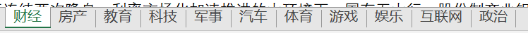

平均每一类有4000条，房产、科技超过4000条，军事较少，仅有3500条。

#### 2. 划分训练集，转换为txt

（选择thres=30，把所有字符小于30的文本全部过滤掉）

训练集测试集划分策略：35000：9242

随机选取35000作为训练集（建立在所有类别个数相差不大的情况下）

详情见sougoPro

（我有用到验证集嘛？）

#### 3. 分析句子长度

发现句子最长有26038个字符，最短有空的

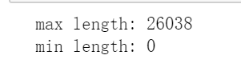

然后我们去除字符长度小于20的标本

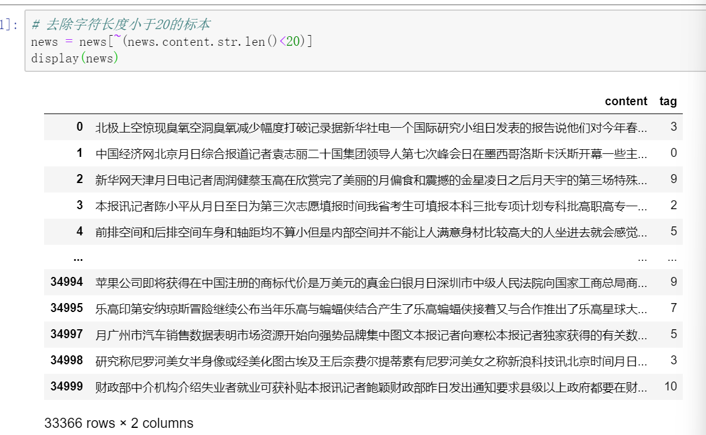

数据条过滤完成，从35000->35000-1481=33519->33366

#### 4. jieba分词

#### 5. 去除停用词

综合四个停用词表，得到共3890个停用词（详见all_stopwords）

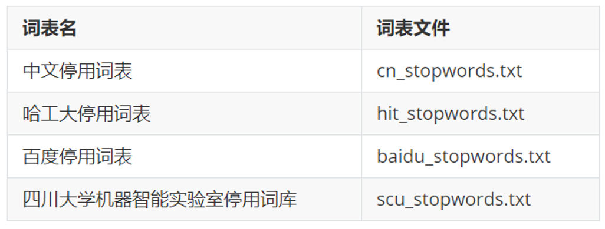

分词和去除停用词之后的句子：

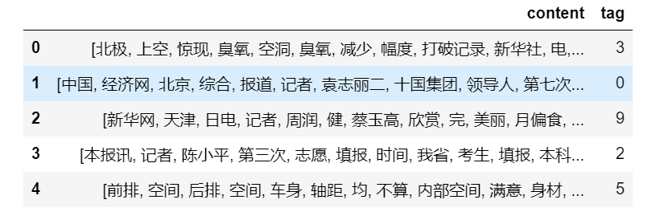

#### 6. 查看标签分类条数

还算比较均衡  除了3和4   后面我们会有处理方法

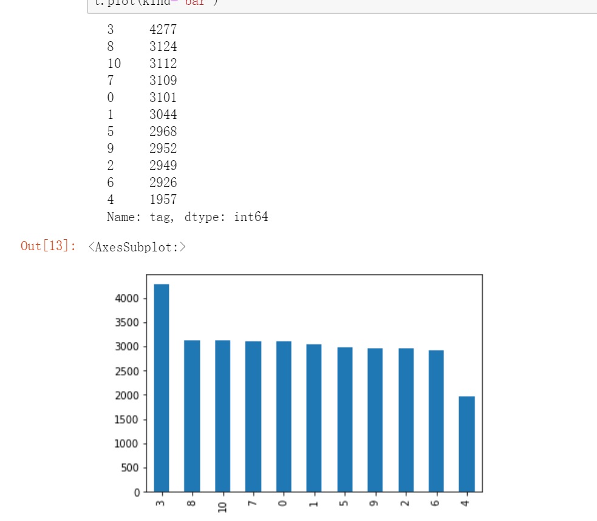

#### 7. 构建整体词云图

查看词语重复量：

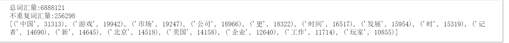

整体词云图：

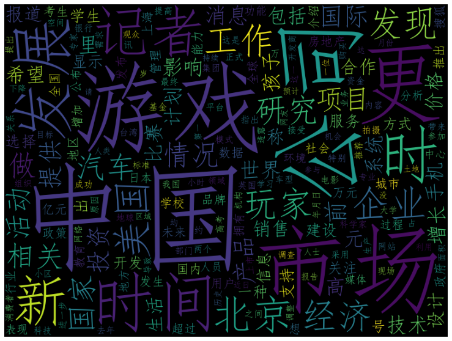

#### 8. 划分数据集

3：1  train_test_split

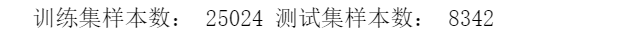

#### 9. TF-IDF构建词向量

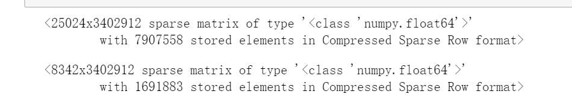

维度非常大，3402912维度！

#### 10 词袋构建词向量

特征的维度还是ok的

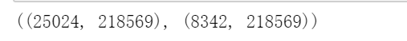

### 二、机器学习结果

#### 1 逻辑回归预测

##### 1.1 tf-idf

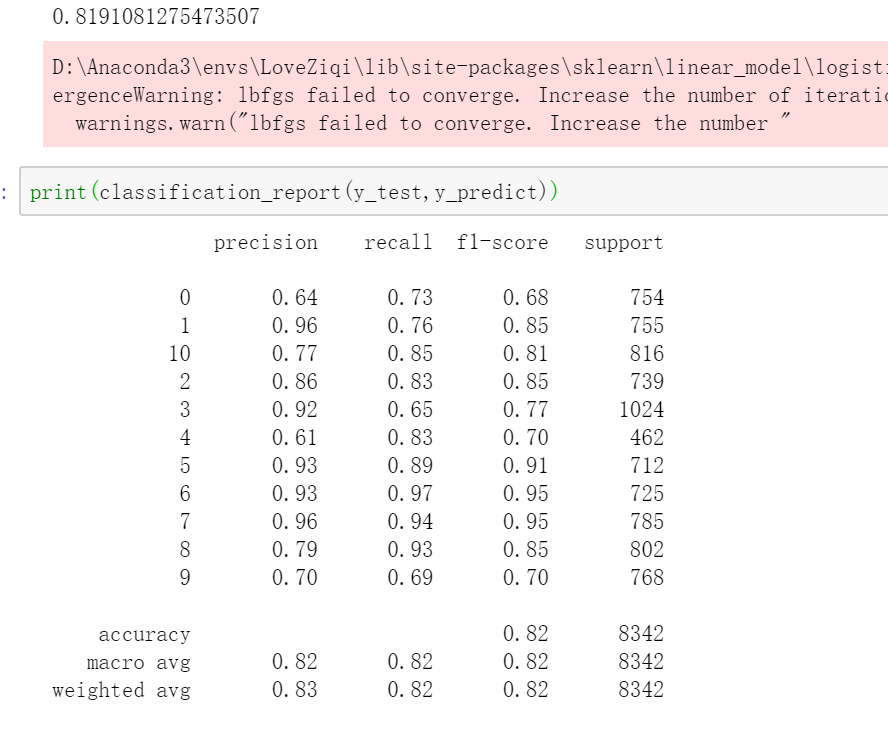

##### 1.2 词袋

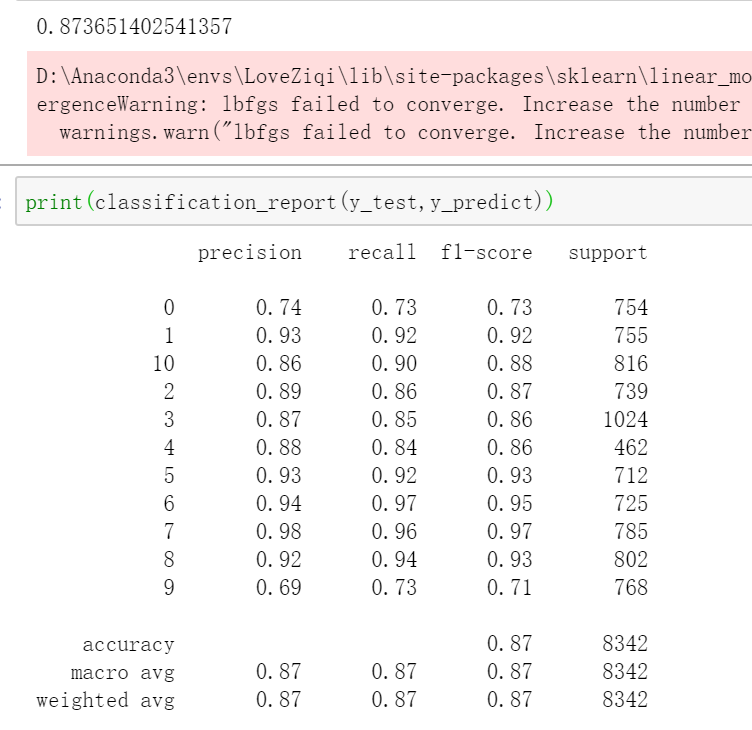

#### 2 KNN

##### 2.1 tf-idf 

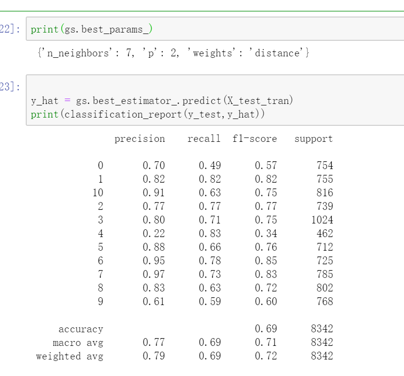

##### 2.2 词袋

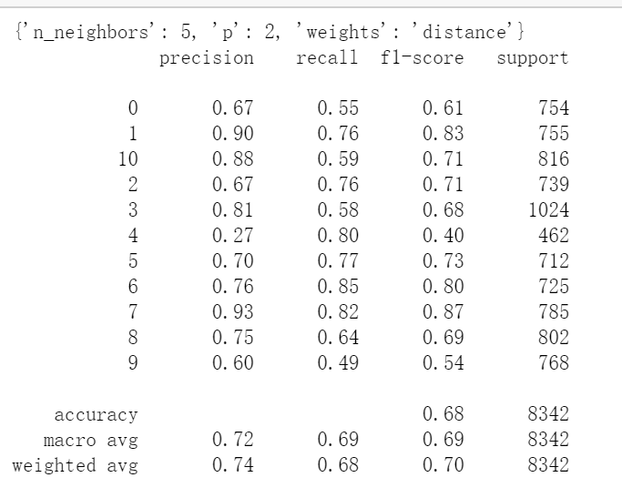

#### 3 决策树

##### 3.1 tf-idf

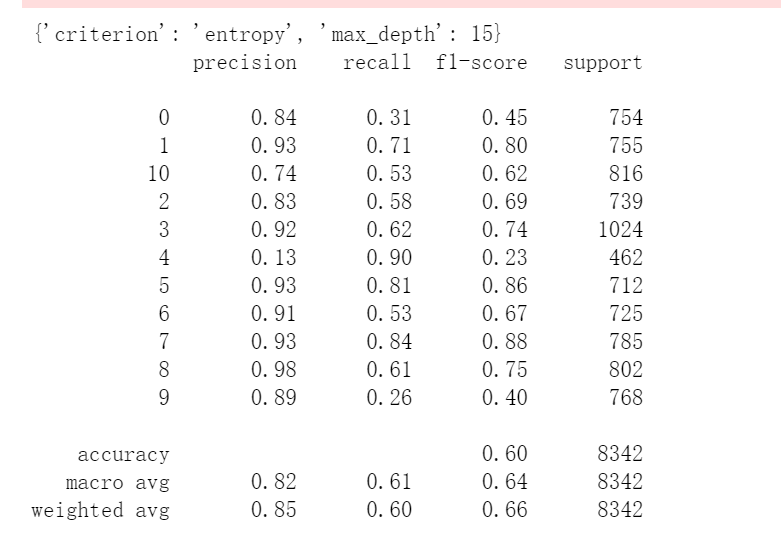

##### 3.2 词袋

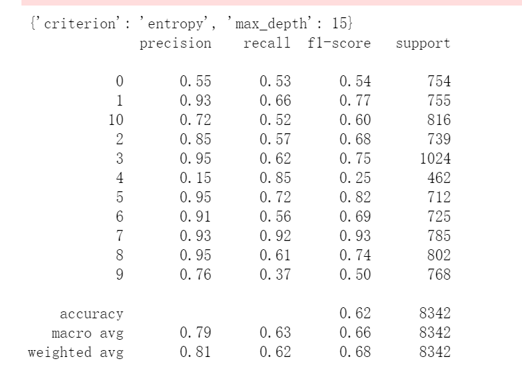
